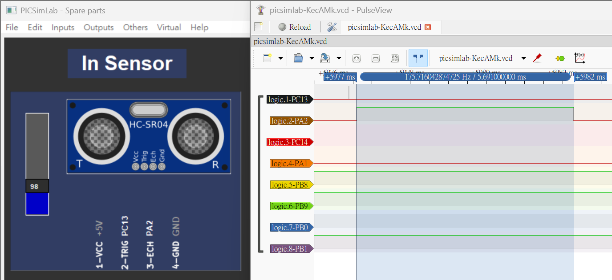

# 【微處理機】中興大學課程期末專題  
## 繳交資訊
- 作者：4112064201 電資二 鍾冠泓
- 所有程式專案可在 projects 資料夾中找到，附有 `.pcf` 檔
- 有沒有問題啊？如有疑問請來信 [chungkuanhung@gmail.com](mailto:chungkuanhung@gmail.com)
- 同步發佈於 [Github](https://github.com/chungkuanhung/microprocessor_final)

## 1. (15 pts) 下列請以 GPIOB 完成，七段顯示器型號為 DC56-11EWA：
### i. (5 pts) 將所有 pin 設定為 output mode，並使 pin 0~15 輸出為 0xAAAA。


---

**答案：**

程式碼 ([projects/1-i/Src/main.c](projects/1-i/Src/main.c))：

```c
#include "stm32f10x.h"

int main() {
    RCC->APB2ENR |= 0xFC;  // 啟用 GPIO 連接埠的 clock

    GPIOB->CRL = 0x33333333;  // PB0 to PB7 outputs
    GPIOB->CRH = 0x33333333;  // PB8 to PB15 outputs

    while (1) {
        GPIOB->ODR = 0xAAAA;
    }
}
```

執行結果截圖：


### ii. (5 pts) 根據圖一完成表一：(Low 為輸出低電壓 0，High 為輸出高電位 1)


---

**答案：**

|     |     |     |     |     |     |     |     |     |           |
| --- | --- | --- | --- | --- | --- | --- | --- | --- | --------- |
|     | x   | g   | f   | e   | d   | c   | b   | a   | PORTB_ODR |
| 0   | L   | L   | H   | H   | H   | H   | H   | H   | 0x3F      |
| 1   | L   | L   | L   | L   | L   | H   | H   | L   | 0x6       |
| 2   | L   | H   | L   | H   | H   | L   | H   | H   | 0x5B      |
| 3   | L   | H   | L   | L   | H   | H   | H   | H   | 0x4F      |
| 4   | L   | H   | H   | L   | L   | H   | H   | L   | 0x66      |
| 5   | L   | H   | H   | L   | H   | H   | L   | H   | 0x6D      |
| 6   | L   | H   | H   | H   | H   | H   | L   | H   | 0x7D      |
| 7   | L   | L   | H   | L   | L   | H   | H   | H   | 0x27      |
| 8   | L   | H   | H   | H   | H   | H   | H   | H   | 0x7F      |
| 9   | L   | H   | H   | L   | H   | H   | H   | H   | 0x6F      |

### iii. (5 pts) 編寫程式使七段顯示器顯示 20。

**答案：**

程式碼 ([projects/1-iii/Src/main.c](projects/1-iii/Src/main.c))：

```c
#include "stm32f10x.h"

int main() {
    RCC->APB2ENR |= 0xFC;  // 啟用 GPIO 連接埠的 clock

    GPIOB->CRL = 0x33333333;  // PB0 to PB7 outputs
    GPIOB->CRH = 0x33333333;  // PB8 to PB15 outputs

    while (1) {
        GPIOB->ODR = 0x3F5B;
    }
}
```

執行結果截圖：


## 2. (10 pts) 下列請以 GPIOA 完成，超音波模組型號為 HC-SR04：
### i. (5 pts) Generate a pulse with a duration of 10us via PA0 using a _for_ loop.


---

**答案：**

- **必須把 Qemu CPU MIPS 設成 `62.5`。**

程式碼 ([projects/2-i/Src/main.c](projects/2-i/Src/main.c))：

```c
#include "stm32f10x.h"

void delay_us(uint16_t t);
void delay_ms(uint16_t t);

int main() {
    RCC->APB2ENR |= 0xFC;  // 啟用 GPIO 連接埠的 clock

    GPIOA->CRL = 0x33333333;  // PA0 to PA7 outputs
    GPIOA->CRH = 0x33333333;  // PA8 to PA15 outputs

    delay_ms(100);  // 緩衝 100ms

    GPIOA->ODR = 1 << 0;  // PA0 ON
    delay_us(10);  // 10us pulse
    GPIOA->ODR = 0 << 0;  // PA0 OFF
}

void delay_us(uint16_t t) {
    volatile unsigned long l = 0;

    for (uint16_t i = 0; i < t; i++)
        for (l = 0; l < 7; l++)
            ;
}
void delay_ms(uint16_t t) {
    volatile unsigned long l = 0;

    for (uint16_t i = 0; i < t; i++)
        for (l = 0; l < 9000; l++)
            ;
}
```


執行結果截圖：


### ii. (5 pts) 編寫程式讀取超音波模組數據。


---

**答案：**

程式碼 ([projects/2-ii/Src/main.c](projects/2-ii/Src/main.c))：

```c
#include "stm32f10x.h"

void delay_us(uint16_t t);
void delay_ms(uint16_t t);

int main() {
    RCC->APB2ENR |= 0xFC;  // 啟用 GPIO 連接埠的 clock

    GPIOA->CRL = 0x33333343;  // PA0, PA2 ~ PA7 outputs, PA1 input
    GPIOA->CRH = 0x33333333;  // PA8 to PA15 outputs

    delay_ms(100);  // 緩衝 100ms

    GPIOA->ODR = 1 << 0;  // PA0 ON
    delay_us(10);  // 10us pulse
    GPIOA->ODR = 0 << 0;  // PA0 OFF
}

void delay_us(uint16_t t) {
    volatile unsigned long l = 0;

    for (uint16_t i = 0; i < t; i++)
        for (l = 0; l < 7; l++)
            ;
}
void delay_ms(uint16_t t) {
    volatile unsigned long l = 0;

    for (uint16_t i = 0; i < t; i++)
        for (l = 0; l < 9000; l++)
            ;
}
```

執行結果截圖：


## 3. (10 pts) 下列請以 TIM2 (PWM) 完成，伺服馬達型號為 SG90：
### i. (5 pts) Generate a square wave with a period 20ms.


---

**答案：**

程式碼 ([projects/3-i/Src/main.c](projects/3-i/Src/main.c))：

```c
#include "stm32f10x.h"

int main() {
    RCC->APB2ENR |= 0xFC;      // 啟用 GPIO 連接埠的 clock
    RCC->APB1ENR |= (1 << 0);  // 啟用 TIM2 clock
    GPIOA->CRL |= 0xB;         // PA0 為 50MHz output
    TIM2->CCER = 0x1;          // CC1P = 0, CC1E = 1
    TIM2->CCMR1 |= 0x60;       // 設定為 PWM 1
    TIM2->PSC = 72 - 1;        // TIM2 時脈頻率為 72MHz
    TIM2->ARR = 20000 - 1;     // 週期為 20ms
    TIM2->CCR1 = 5000;         // Duty Cycle = 5000 / 20000 = 25%
    TIM2->CR1 = 1;             // 正向計數

    while (1) { }
}
```

執行結果截圖：


### ii. (5 pts) 編寫程式使伺服馬達順時針與逆時針旋轉。

---

**答案：**

伺服馬達（SG90）的旋轉角度是透過波形的 duty cycle來控制。

- Period: 20ms
- Duty cycle:
  - 1ms: 0 度
  - 1.5ms: 90 度
  - 2ms: 180 度

程式碼 ([projects/3-ii/Src/main.c](projects/3-ii/Src/main.c))：

```c
#include "stm32f10x.h"

void delay_ms(uint16_t t);

int main() {
    RCC->APB2ENR |= 0xFC;      // 啟用 GPIO 連接埠的 clock
    RCC->APB1ENR |= (1 << 0);  // 啟用 TIM2 clock
    GPIOA->CRL |= 0xB;         // PA0 為 50MHz output
    TIM2->CCER = 0x1;          // CC1P = 0, CC1E = 1
    TIM2->CCMR1 |= 0x60;       // 設定為 PWM 1
    TIM2->PSC = 72 - 1;        // TIM2 時脈頻率為 72MHz
    TIM2->ARR = 20000 - 1;     // 週期為 20ms
    TIM2->CCR1 = 1500;         // 初始值設定為 90 度 (1.5ms)
    TIM2->CR1 = 1;

    while (1) {
        // 順時針轉至 180 度 (2ms)
        TIM2->CCR1 = 2000;
        delay_ms(10000);

        // 逆時針轉至 0 度 (1ms)
        TIM2->CCR1 = 1000;
        delay_ms(10000);

//      // 返回 90 度 (1.5ms)
//		TIM2->CCR1 = 1500;
//		delay_ms(10000);
    }
}

void delay_ms(uint16_t t)
{
    volatile unsigned long l = 0;

    for (uint16_t i = 0; i < t; i++)
        for (l = 0; l < 9000; l++)
            ;
}

```

執行結果截圖：

0 度：


180 度：


## 4. (10 pts) 下列請以 USART1 (baud rate 為 9600) 完成，藍芽模組型號為 HC-06：
### i. (5 pts) Send a character ('A') to the IO Virtual Term.

---

**答案：**

程式碼 ([projects/4-i/Src/main.c](projects/4-i/Src/main.c))：

```c
#include "stm32f10x.h"

void delay_ms(uint16_t t);
void usart1_sendByte(unsigned char c);

int main() {
    RCC->APB2ENR |= (1 << 14) | (1 << 2);  // 啟用 GPIOA 和 USART1 clock
    GPIOA->CRH |= 0x000000B0;  // PA9 為 50MHz output
    USART1->CR1 = 0x200C;  // UE, TE, RE 為 1
    USART1->BRR = 7500;

    usart1_sendByte('A');
}

void delay_ms(uint16_t t) {
    volatile unsigned long l = 0;

    for (uint16_t i = 0; i < t; i++)
        for (l = 0; l < 9000; l++)
            ;
}

void usart1_sendByte(unsigned char c) {
    USART1->DR = c;  // 字元放進 Data register
    while ((USART1->SR & (1 << 6)) == 0)  // 檢查 SR 和 TC flag
        ;
}
```

執行結果截圖：


### ii. (5 pts) 編寫程式使藍芽 (USART1) 每秒發送一個數字給 IO Virtual Term，數字依序為 0 至 20。

---

**答案：**

程式碼 ([projects/4-ii/Src/main.c](projects/4-ii/Src/main.c))：

```c
#include "stm32f10x.h"
#include <string.h>

void delay_ms(uint16_t t);
void usart1_sendByte(unsigned char c);
void usart1_sendStr(char* str);  // 輸出字串

int main() {
    RCC->APB2ENR |= (1 << 14) | (1 << 2);  // 啟用 GPIOA 和 USART1 clock
    GPIOA->CRH |= 0x000000B0;  // PA9 為 50MHz output
    USART1->CR1 = 0x200C;  // UE, TE, RE 為 1
    USART1->BRR = 7500;

    char tx_buffer[10];  // 儲存數字字串的緩衝區

    for (int i = 0; i <= 20; i++) {
        sprintf(tx_buffer, "%d\r\n", i);  // 數字轉換為字串
        usart1_sendStr(tx_buffer);
        delay_ms(1000);
    }
}

void delay_ms(uint16_t t) {
    volatile unsigned long l = 0;

    for (uint16_t i = 0; i < t; i++)
        for (l = 0; l < 9000; l++)
            ;
}

void usart1_sendByte(unsigned char c) {
    USART1->DR = c;  // 字元放進 Data register
    while ((USART1->SR & (1 << 6)) == 0)  // 檢查 SR 和 TC flag
        ;
}

void usart1_sendStr(char* str) {
    int counter = 0;
    while (str[counter] != '\0') {
        usart1_sendByte(str[counter]);
        counter++;
    }
}
```

執行結果截圖：


## 5. (55 pts) 下列請以 Interrupt 與 Timer 完成系統整合實現停車場系統（有關時間的都要用 Timer 或 SysTick 實現）：
### i. 超音波感測（建議使用 Timer2）
#### A. (5 pts) 入口每 5 秒產生一個 trig 檢測是否有車子要進來。

---

**答案：**

入口 (PC13) 每 5 秒產生一個 trig。

執行結果截圖：


#### B. (5 pts) 出口先延遲 2.5 秒再每 5 秒產生一個 trig 是否有車子要出去。

每 5 秒產生一次 trig 示意圖：


入口跟出口的 trig 時間相差 2.5 秒的示意圖：


---

**答案：**

出口 (PC14) 先延遲 2.5 秒，之後每 5 秒產生一個 trig。

執行結果截圖：


#### C. (15 pts) 使用中斷捕捉 Echo 上升時間和下降時間，然後透過下面公式轉換成公尺。（建議使用 SysTick 中斷，出來的結果與實際有誤差是正常現象）

$Echo\ signal\ duration * 343 / 2\ meters$


---

**答案：**

透過波形圖可以看到持續時間為 5.691ms，經由下面的公式計算距離約為 97.6cm，與超音波感測器的數值 98 相當接近。

(5.691 / 1000) * 343 / 2 = 0.9760065

執行結果截圖：



### ii. 伺服馬達閘門（建議使用 Timer1 和 Timer2）
#### A. (10 pts) 當出入口的 Echo 讀到的值小於 100m，相對應的閘門要打開讓車子進出，然後關閉閘門（伺服馬達打開和關閉閘門 90 度轉動）。

---

**答案：**

入口偵測到車輛時，開啟閘門。

執行結果截圖：


出口偵測到車輛時，開啟閘門。

執行結果截圖：


#### B. (10 pts) 車輛進入時剩餘車位減 1，車輛出去時剩餘車輛位加 1，並將剩餘車位數顯示於 2-digit 七位顯示器（車位數初始值 20）。

---

**答案：**

入口偵測到車輛時，剩餘車位減 1，並將數字顯示於七段顯示器。

執行結果截圖：


出口偵測到車輛時，剩餘車位加 1，並將數字顯示於七段顯示器。

執行結果截圖：


#### C. (5 pts) 當車位停滿時，七段顯示器顯示 00 並以一秒為週期進行閃爍（連續重複亮 0.5 sec 與暗 0.5 sec）。此時，閘門維持不動。

---

**答案：**

剩餘車位為 0 時，七段顯示器重複亮 0.5s 與暗 0.5s，閘門維持不動。

執行結果截圖：


透過PB8、PB9、PB0、PB1 波形圖可以看到，亮、暗持續時間皆為 0.5s：


#### D. (5 pts) 透過藍芽 (USART1) 傳送目前車輛數目給 IO Virtual Term（轉成兩個數字的 ASCII Code 後傳送）。

---

**答案：**

入口偵測到車輛時，目前車輛數目加 1，並透過藍芽 (USART1) 將數字傳送給 IO Virtual Term。

執行結果截圖：


出口偵測到車輛時，目前車輛數目減 1，並透過藍芽 (USART1) 將數字傳送給 IO Virtual Term。

執行結果截圖：


### 完整程式碼

([projects/5/Src/main.c](projects/5/Src/main.c))

```c
#include "stm32f10x.h"
#include <stdio.h>
#include <string.h>
#include <stdbool.h>

// --- 全域變數 ---
// 超音波感測器
static volatile uint32_t in_sensor_echo_begin_us = 0;   // 入口 Echo 上升時間
static volatile uint32_t out_sensor_echo_begin_us = 0;  // 出口 Echo 上升時間
volatile uint32_t in_sensor_echo_duration_us = 0;       // 入口 Echo 持續時間
volatile uint32_t out_sensor_echo_duration_us = 0;      // 出口 Echo 持續時間
volatile bool in_sensor_measurement = false;            // 入口是否偵測到車輛
volatile bool out_sensor_measurement = false;           // 出口是否偵測到車輛

// 計時與計數
volatile uint32_t us_counter = 0;            // SysTick 中斷累加的計時器 (us)
volatile int available_parking_spaces = 20;  // 剩餘停車位

// USART
char usart_tx_buffer[128];            // 發送資料的緩衝區
volatile uint16_t usart_tx_head = 0;  // 寫入指標
volatile uint16_t usart_tx_tail = 0;  // 讀取指標

// 宣告函式
void setup(void);                      // 初始設定
void delay_us(uint32_t us);            // 延遲 us
void delay_ms(uint32_t ms);            // 延遲 ms
void usart1_send_str(char *str);       // 透過 USART1 發送字串
void update_seven_segment(int count);  // 更新七段顯示器顯示

int main(void) {
	setup();

	uint32_t last_usart_send_us = 0;
	uint32_t last_in_sensor_trig_us = 0;
	uint32_t last_out_sensor_trig_us = 0;
	bool out_sensor_trig_active = false;  // 用於錯開兩個感測器的觸發時間

	update_seven_segment(available_parking_spaces);

	while (1) {
		float distance_m;
		char buffer[30];

		// --- 週期性 Trig ---
		// 每 5 秒觸發一次入口感測器
		if (us_counter - last_in_sensor_trig_us >= 5 * 1000 * 1000) {

			last_in_sensor_trig_us = us_counter;
			GPIOC->BSRR = (1 << 13);
			delay_us(10);
			GPIOC->BRR = (1 << 13);
		}

		// 延遲 2.5 秒後才開始觸發出口感測器
		if (!out_sensor_trig_active && us_counter >= 5 * 1000 * 1000 / 2) {
			out_sensor_trig_active = true;
			last_out_sensor_trig_us = us_counter;
		}

		// 如果出口觸發已啟動，則每 5 秒觸發一次出口感測器
		if (out_sensor_trig_active
				&& (us_counter - last_out_sensor_trig_us >= 5 * 1000 * 1000)) {
			last_out_sensor_trig_us = us_counter;
			GPIOC->BSRR = (1 << 14);
			delay_us(10);
			GPIOC->BRR = (1 << 14);
		}

		// --- 感測器偵測 ---
		if (in_sensor_measurement) {
			in_sensor_measurement = false;

			distance_m = (in_sensor_echo_duration_us * 343.0 / 2.0) / 1000000.0;
			if (distance_m < 1.0 && available_parking_spaces > 0) {
				available_parking_spaces--;
				TIM1->CCR1 = 1500;  // 開啟入口閘門
				delay_ms(450);  // 閘門開啟持續時間 (ms)，大於 500 會出現錯誤
				TIM1->CCR1 = 2500;  // 關閉入口閘門
			}
		}

		if (out_sensor_measurement) {
			out_sensor_measurement = false;

			distance_m = (out_sensor_echo_duration_us * 343.0 / 2.0) / 1000000.0;

			if (distance_m < 1.0 && available_parking_spaces < 20) {
				available_parking_spaces++;
				TIM2->CCR1 = 1500;  // 開啟出口閘門
				delay_ms(450);  // 閘門開啟持續時間 (ms)，大於 500 會出現錯誤
				TIM2->CCR1 = 500;  // 關閉出口閘門
			}
		}

		if (available_parking_spaces == 0) {
			if ((us_counter / 500000) % 2) {
				GPIOB->ODR = 0x0000;
			} else {
				update_seven_segment(0);
			}
		} else {
			update_seven_segment(available_parking_spaces);
		}

		if (us_counter - last_usart_send_us >= 500000) {
			last_usart_send_us = us_counter;
			sprintf(buffer, "Parking Cars: %02d\r\n",
					20 - available_parking_spaces);
			usart1_send_str(buffer);
		}
	}
}

void setup(void) {
	// 啟用時脈
	RCC->APB2ENR |= (1 << 0) | (1 << 2) | (1 << 3) | (1 << 4) | (1 << 11)
			| (1 << 14);
	RCC->APB1ENR |= (1 << 0);

	// GPIO 腳位功能
	// PA0, PA1, PA2
	GPIOA->CRL = (GPIOA->CRL & ~0x00000FFF) | (0x8 << 8) | (0x8 << 4)
			| (0xB << 0);
	GPIOA->ODR &= ~((1 << 1) | (1 << 2));
	// PA8, PA9, PA10
	GPIOA->CRH = (GPIOA->CRH & ~0x00000FFF) | (0x4 << 8) | (0xB << 4)
			| (0xB << 0);
	GPIOB->CRL = 0x33333333;  // PB0 to PB7
	GPIOB->CRH = 0x33333333;  // PB8 to PB15
	GPIOC->CRH = (GPIOC->CRH & ~0x0FF00000) | 0x03300000;  // PC13 to PC14

	// SysTick 計時器 (每 10us 觸發一次中斷，並將全域變數 us_counter 增加 10)
	SysTick->LOAD = 270 - 1;  // (10 * 27MHz / 1MHz) - 1
	SysTick->VAL = 0;
	SysTick->CTRL = (1 << 0) | (1 << 1);

	// TIM1 & TIM2 PWM
	TIM1->PSC = 144 - 1;    // (144MHz / 1MHz) - 1
	TIM1->ARR = 20000 - 1;  // 週期為 20ms
	TIM1->CCR1 = 2500;      // 關閉入口閘門
	TIM1->CCMR1 = (1 << 6) | (1 << 5) | (1 << 3);
	TIM1->CCER = (1 << 0);
	TIM1->BDTR = (1 << 15);
	TIM1->CR1 = (1 << 7) | (1 << 0);

	TIM2->PSC = 72 - 1;     // TIM2 時脈頻率為 72MHz
	TIM2->ARR = 20000 - 1;  // 週期為 20ms
	TIM2->CCR1 = 500;       // 關閉出口閘門
	TIM2->CCMR1 = (1 << 6) | (1 << 5) | (1 << 3);
	TIM2->CCER = (1 << 0);
	TIM2->CR1 = (1 << 7) | (1 << 0);

	// USART1
	USART1->BRR = 7500;  // 設定鮑率為 9600 (在 72MHz APB2 時脈下，72M / 9600 = 7500)
	USART1->CR1 = (1 << 13) | (1 << 2) | (1 << 3) | (1 << 5);  // 啟用 USART、傳送器、接收器及接收中斷

	// EXTI & NVIC
	AFIO->EXTICR[0] = (AFIO->EXTICR[0] & ~0x0FF0) | (0x0 << 8) | (0x0 << 4);
	EXTI->IMR |= (1 << 1) | (1 << 2);
	EXTI->RTSR |= (1 << 1) | (1 << 2);
	EXTI->FTSR |= (1 << 1) | (1 << 2);
	NVIC->ISER[0] |= (1 << 7) | (1 << 8);  // 只啟用 EXTI1, EXTI2 中斷
	NVIC->ISER[1] |= (1U << (USART1_IRQn - 32));  // 啟用 USART1 中斷 (IRQ 37)
}

void delay_us(uint32_t us) {
	uint32_t start = us_counter;
	while ((us_counter - start) < us)
		;
}

void delay_ms(uint32_t ms) {
	for (uint32_t i = 0; i < ms; i++) {
		delay_us(1000);
	}
}

// ISRs (中斷)
// SysTick 中斷：僅用於累加 us_counter
void SysTick_Handler(void) {
	us_counter += 10; // 每 10us 一次 += 10
}

void USART1_IRQHandler(void) {
	// 檢查是否為 TXE (發送緩存區空) 中斷
	if ((USART1->SR & (1 << 7)) != 0) {
		if (usart_tx_head != usart_tx_tail) {
			// 如果緩衝區還有資料，載入下一個字元至傳送暫存器
			USART1->DR = usart_tx_buffer[usart_tx_tail];
			usart_tx_tail = (usart_tx_tail + 1) % 128;
		} else {
			// 如果緩衝區已空，關閉 TXE 中斷
			USART1->CR1 &= ~(1 << 7);
		}
	}
}

// EXTI 中斷
void EXTI1_IRQHandler(void) {  // 出口感測器 Echo (PA1)
	if ((EXTI->PR & (1 << 1)) != 0) {
		if ((GPIOA->IDR & (1 << 1)) != 0) {
			out_sensor_echo_begin_us = us_counter;
		} else {
			out_sensor_echo_duration_us = us_counter - out_sensor_echo_begin_us;
			out_sensor_measurement = true;
		}
		EXTI->PR = (1 << 1);  // 清除中斷
	}
}

void EXTI2_IRQHandler(void) {  // 入口感測器 Echo (PA2)
	if ((EXTI->PR & (1 << 2)) != 0) {
		if ((GPIOA->IDR & (1 << 2)) != 0) {
			in_sensor_echo_begin_us = us_counter;
		} else {
			in_sensor_echo_duration_us = us_counter - in_sensor_echo_begin_us;
			in_sensor_measurement = true;
		}
		EXTI->PR = (1 << 2);  // 清除中斷
	}
}

void usart1_send_str(char *str) {
	while (*str) {
		// 將字元存入傳送緩衝區
		usart_tx_buffer[usart_tx_head] = *str++;
		usart_tx_head = (usart_tx_head + 1) % 128;
	}
	// 啟用 TXE 中斷，啟動發送
	USART1->CR1 |= (1 << 7);
}

void update_seven_segment(int count) {
	uint16_t arr[10] = { 0x3F, 0x06, 0x5B, 0x4F, 0x66, 0x6D, 0x7D, 0x27, 0x7F,
			0x6F };
	if (count >= 0 && count <= 99) {
		GPIOB->ODR = (arr[count / 10] << 8) | arr[count % 10];
	}
}
```